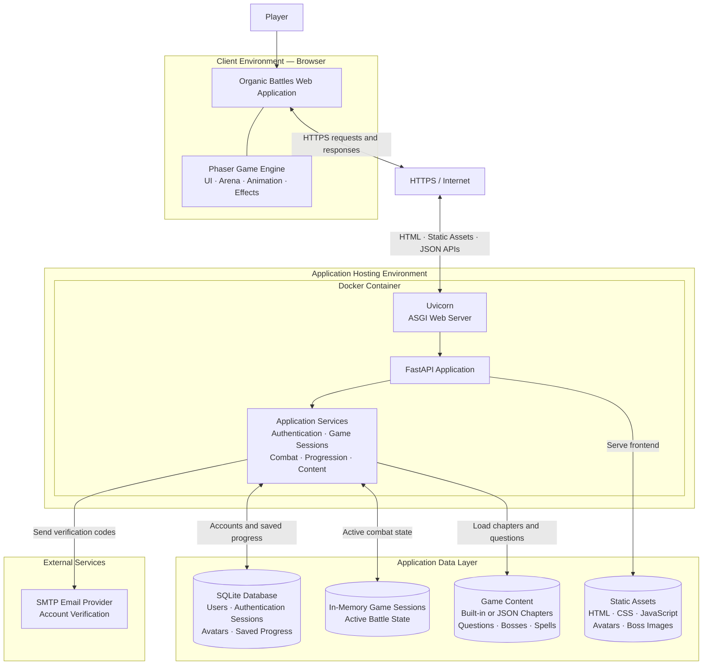

# Organic Battles V2

Organic Battles V2 is a browser-based educational RPG where organic chemistry vocabulary powers fantasy combat. FastAPI is authoritative for questions, damage, HP, cooldowns, boss attacks, progression, rewards, and avatar permanence. Phaser renders the responsive battle arena and procedural combat silhouettes/effects.

## Technology stack and frameworks

Organic Battles V2 uses a browser-based game frontend backed by a single Python web application.

| Layer | Framework or technology | Purpose |
| --- | --- | --- |
| Backend application | FastAPI 0.115.6 | Provides account, authentication, question, combat, progression, reward, and game-content APIs. It is authoritative for damage, HP, cooldowns, boss attacks, and progression rules. |
| ASGI server | Uvicorn 0.34.0 | Runs and serves the FastAPI application. |
| Frontend game engine | Phaser | Renders the responsive browser battle arena, characters, procedural combat silhouettes, animations, and effects using web technologies. |
| Database | SQLite | Stores users, verification codes, authentication sessions, permanent avatar selections, and saved game progress in `organic_battles.sqlite3` by default. |
| Automated testing | Pytest 8.3.4 | Runs the Python test suite. |
| HTTP/API testing | HTTPX 0.28.1 | Sends HTTP requests when testing FastAPI endpoints. |
| Configuration | python-dotenv 1.0.1 and TOMLI 2.0.1 | Loads environment variables, `.env` configuration, and TOML-based local secrets. |
| Account email | SMTP | Delivers six-digit email confirmation codes without exposing mail credentials to frontend code. |
| Game-content storage | JSON | Optionally supplies all 27 chapters, questions, explanations, spells, bosses, and image references from the `data/` directory. |
| Containerization | Docker | Packages the application on the `python:3.12-slim` base image for deployment. |

### Architecture summary

- **Frontend:** Phaser with browser-native HTML, CSS, and JavaScript.
- **Backend:** Python and FastAPI.
- **Database:** SQLite.
- **Application server:** Uvicorn.
- **Testing:** Pytest and HTTPX.
- **Deployment:** Docker or a standard Python host.

This project does not use Streamlit, Django, Flask, React, Angular, or Next.js. The FastAPI server hosts the application and remains authoritative for security-sensitive game state and rules.

## System-level architecture



### Runtime responsibilities

- **Phaser and the browser** render the interface, battle arena, avatars, animations, and effects, and send player actions to the API.
- **Uvicorn** listens for HTTP traffic, converts requests to ASGI messages, invokes FastAPI, and returns API responses and frontend files to the browser.
- **FastAPI** exposes authentication, avatar, game-state, battle, and progression endpoints and enforces ownership and authentication checks.
- **The server-side game engine** controls questions, spell availability, damage, backfires, cooldowns, 50/50 boss counterattacks, rewards, and chapter progression.
- **SQLite** persists accounts, hashed verification codes, hashed authentication-session tokens, avatar selections, and serialized game progress.
- **The in-memory session dictionary** holds active `Session` objects while the Python process is running.
- **SMTP** sends the six-digit verification code. If SMTP is not configured, development mode prints the code only to the server terminal.

### API groups

| API group | Representative endpoints | Responsibility |
| --- | --- | --- |
| Authentication | `/api/auth/signup`, `/verify`, `/resend`, `/login`, `/me`, `/logout` | Account creation, verification, login, cookies, bearer tokens, and logout |
| Game state | `/api/game/new`, `/api/game/state` | Creates an active game session and returns authoritative state |
| Avatar | `/api/avatar/finalize` | Validates and permanently saves the selected avatar |
| Battle | `/api/battle/select-spell`, `/answer`, `/retry`, `/next-turn` | Runs questions, combat calculations, cooldowns, retries, and progression |
| Progression | `/api/progression` | Returns the authenticated player's current game state and rewards |

### Why Uvicorn is required

FastAPI defines the application, routes, validation, and business logic, but it is not the network server. Uvicorn is the ASGI server that makes the FastAPI application reachable over HTTP. The command `uvicorn app:app` means: load the `app` FastAPI object from `app.py`, listen for requests, pass them to FastAPI, and return the resulting HTML, files, or JSON responses.

### Current persistence and scaling limitation

Saved progress is written to SQLite, but active game sessions are also kept in the process-local `sessions` dictionary. A server restart clears those active session objects, and separate Uvicorn workers or containers cannot share them. Before horizontally scaling a paid production deployment, move active sessions to a shared store such as Redis or a database-backed session repository. SQLite may also need to be replaced with a managed relational database when concurrent traffic and write volume grow.

### Configuration note

The Docker image currently uses Python 3.12, while `pyproject.toml` declares `requires-python = ">=3.14"`. These versions should be aligned. Runtime dependencies are currently declared in `requirements.txt`; `pyproject.toml` only lists `pip`, so the two dependency definitions should also be synchronized if `pyproject.toml` will be used for installation or packaging.

The current `app.py` also initializes `FastAPI` and mounts `/static` twice consecutively. The second initialization replaces the first application object, so the duplicate initialization and mount should be removed for clarity.

## Run locally

```bash
python -m venv .venv
.venv\\Scripts\\activate
pip install -r requirements.txt
uvicorn app:app --reload
```

Open `http://127.0.0.1:8000`. Run tests with `pytest`.

## Accounts and email setup

Accounts are stored in SQLite at `organic_battles.sqlite3` (override with `DATABASE_PATH`). Passwords and confirmation codes are stored as one-way hashes. The browser receives only an HttpOnly session cookie; no Google API key or SMTP credential is used in frontend code.

For local testing without mail credentials, leave `SMTP_HOST` unset. The server prints the confirmation code to its terminal; this is development-only behavior and the code is never returned by an API. To use a local file, copy `.env.example` to `.env`; the server loads it automatically at startup. Existing system environment variables take precedence. For real delivery, configure an SMTP provider. Gmail works with a Google account SMTP app password (enable 2-Step Verification and create an app password):

```text
SMTP_HOST=smtp.gmail.com
SMTP_PORT=587
SMTP_USERNAME=your-account@gmail.com
SMTP_PASSWORD=your-16-character-app-password
SMTP_FROM=your-account@gmail.com
COOKIE_SECURE=1       # use 1 behind HTTPS
```

Copy these values into the server environment, never into JavaScript or a committed file. Restart the server after changing them. New users must enter the emailed six-digit code within 15 minutes; resending invalidates the previous code. A verified login opens avatar onboarding, and the selected avatar is saved to the same account.

Alternatively, local development may use the ignored `secrets.toml` file. Put the Gmail sender and app password under `[gmail]` as shown in that file. Environment variables take precedence over `secrets.toml`. The app password is used for Gmail SMTP authentication; it is not a Google API key.

## Game content source

The server-side switch is `GAME_CONTENT_SOURCE`. It defaults to `app`, which uses the built-in chapters, questions, explanations, and spells in `app.py`. Set it to `json` before starting the server to load every chapter file from `data/`:

```powershell
$env:GAME_CONTENT_SOURCE="json"
uvicorn app:app --reload
```

JSON mode loads all 27 chapters, their questions and explanations, spell damage values, grouped bosses, and each boss image named by the chapter JSON. Boss images are served from `static/assets/bosses/`, populated from the repository’s `bosses/` folder. Set the variable back to `app` to restore the built-in content.

Example local flow: start Uvicorn, click `ENTER THE LABYRINTH`, choose `CREATE ACCOUNT`, submit an email/username/password, copy the code from the Uvicorn terminal, verify it, choose an avatar, and enter the battle. Use a unique username; attempting a duplicate shows `Username taken, choose a different one` in a modal.

The game preserves three chapters, fourteen bosses, nine named spells, 150 player HP, genuine cooldown validation, one-attempt vocabulary questions, 50/50 boss counterattacks, avatar permanence, defeat/retry, rewards, progression locking, and the final `SPECTRAL CHAMPION` title. Questions are originally written and do not reproduce textbook passages verbatim.

## Deployment

The included Dockerfile runs the single FastAPI application with Uvicorn. A standard Python host can use `uvicorn app:app --host 0.0.0.0 --port $PORT`.
